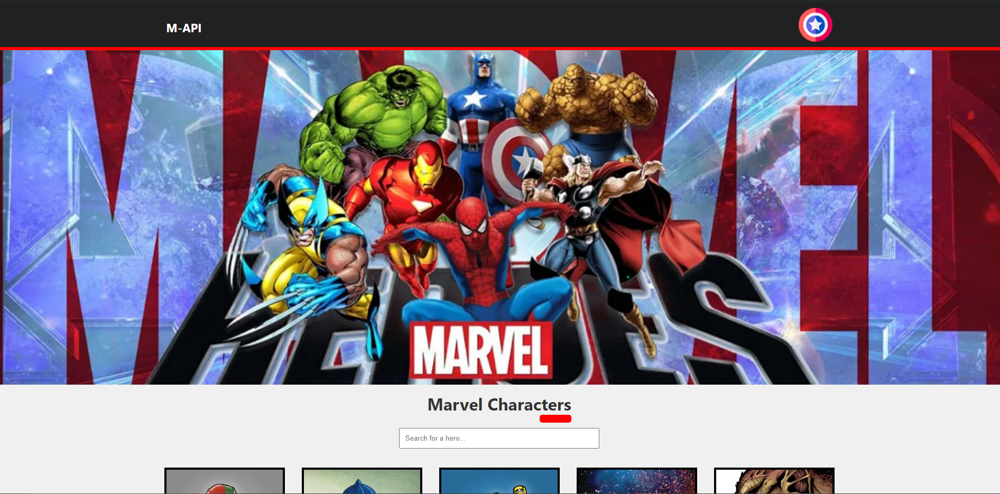

## 🧭 • Marvel API - Projeto

O Marvel API é um projeto Front-end desenvolvido para fornecer é consumir a Marvel Comics API e construir um website que permita a visualização dos personagens retornados por ela

## 📟 • Avanço 
| **Data** | **Modificações** | **Author** |
| --- | --- | --- | 
| **29/08/2024** | **Feat:First commit** | **Gustavo** |
| **29/08/2024** | **Feat:pegando as informações da API** | **Gustavo** |
| **29/08/2024** | **Feat:pegando as informações dos heróis e colocando na tela** | **Gustavo** |
| **29/08/2024** | **Feat:Fim da UI da tela inicial** | **Gustavo** |
| **29/08/2024** | **Feat:Adicionando efeito de hover nos personagens** | **Gustavo** |
| **29/08/2024** | **Feat:Alterando ficon e titulo, adicionando também animação no escudo do capitão america** | **Gustavo** |
| **29/08/2024** | **Fix:Resolvendo problema das imagens sem aparecer** | **Gustavo** |
| **29/08/2024** | **Fix:Ajustando erro Readme.md** | **Gustavo** |
| **29/08/2024** | **Test:Teste nova imagem escudo** | **Gustavo** |
| **30/08/2024** | **Feat:Pegando personagens de forma dinamica** | **Gustavo** |
| **30/08/2024** | **Fix:Ajustando css das paginas** | **Gustavo** |
| **30/08/2024** | **Fix:Ajustando css do footer** | **Gustavo** |
| **30/08/2024** | **Fix:Ajustando as tipagens** | **Gustavo** |
| **30/08/2024** | **Feat:Adicionando os links do header e footer** | **Gustavo** |
| **30/08/2024** | **Feat:Adicionando informações no repositório** | **Gustavo** |
| **30/08/2024** | **Feat:Adicionando filtro** | **Gustavo** |
| **30/08/2024** | **Fix:Ajustando msgs de erro** | **Gustavo** |
| **30/08/2024** | **Fix:Ajustando msgs de erro** | **Gustavo** |
| **30/08/2024** | **Fix:Criando Services** | **Gustavo** |
| **30/08/2024** | **Feat:Adicionando link do deploy** | **Gustavo** |
## 🎂 • Sites 

https://github.com/GustavoRRSilva/TesteTecnicoMerx

https://developer.marvel.com/

https://www.figma.com/design/yDZwwZ7bVcdwLYK76ffsYo/Untitled?node-id=1-4&t=EcHed2NMsFxDsniN-1

https://teste-tecnico-merx.vercel.app/herodetails/1011334

## 🎂 • Tecnologias Utilizadas
- Nextjs com Typescript
- Sass
- Git

## 🎂 • Como utilizar na sua máquina
### Instalação do projeto

Após clonar o projeto do [repositório Github](https://github.com/Tava1/marvel-app), navegue até a raiz e execute o seguinte comando no terminal:

Este comando irá instalar todas as dependências necessárias do projeto.
```NPM
INSTALL && NPM INSTALL SASS
```

Após a instalação das depências, podemos utilizar alguns comando disponíveis.

### :construction: Ambiente de desenvolvimento
Executar o projeto em ambiente local de desenvolvimento.
```
NPM RUN DEV
```

